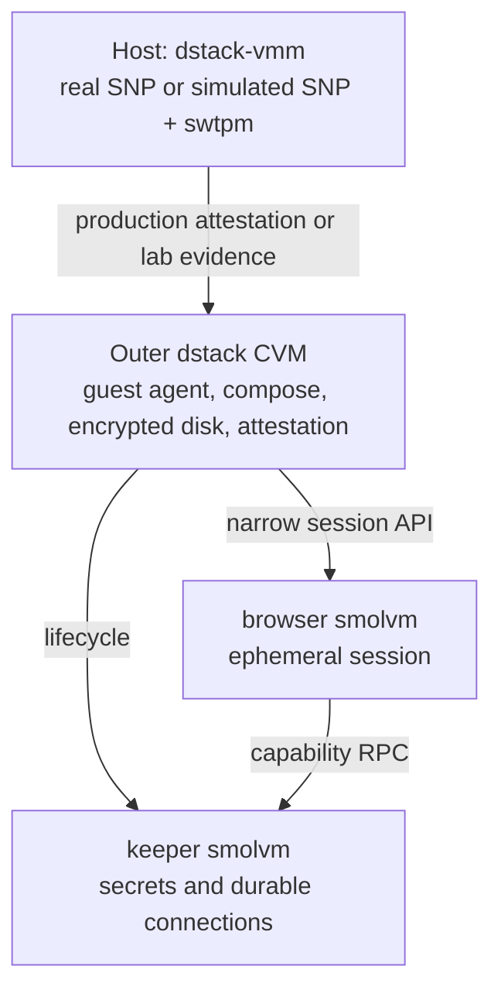

# Eggomi CVM + subVM architecture

Status: private working draft. Upstream dstack/smolvm PRs and issues are
intentionally deferred.

Audience: Eggomi (`tzarebczan/eggomi`) running per-user confidential VMs with
inner isolation layers.

## Goals

1. Run each user workload inside a dstack CVM using AMD SEV-SNP in production.
2. Develop and test without SNP hardware through dstack's existing
   `dstack-amd-sev-snp` simulated TEE.
3. Use smolvm subVMs inside the CVM for isolation, memory ballooning, fast
   lifecycle, and snapshots, not for attestation.
4. Measure RAM, CPU, and disk while exercising representative Eggomi activity.

## Layer model



| Layer | Owns | Does not own |
| --- | --- | --- |
| Outer dstack CVM | Hardware memory encryption in production, measurement, guest agent, KMS identity, encrypted storage, compose services | Fine-grained application sandboxing and elastic per-role memory |
| Inner smolvm | Per-role process/kernel isolation, ballooning, checkpointing, and fast lifecycle | Attestation quotes, VCEK/TDX evidence, and KMS policy |
| Host dstack-vmm | Outer-CVM launch policy, resource caps, and real/simulated TEE selection | Inner-smolvm scheduling |

## Private working copies

| Upstream | Private mirror | Purpose |
| --- | --- | --- |
| `Dstack-TEE/dstack` | `tzarebczan/eggomi-dstack` | dstack integration work |
| `smol-machines/smolvm` | `tzarebczan/smolvm` | subVM runtime |
| `smol-machines/smol` | `tzarebczan/smol` | lifecycle/embed surface |
| `smol-machines/smolvm-sdk` | `tzarebczan/smolvm-sdk` | language SDKs |

Do not open upstream issues or pull requests until explicitly requested. Keep
the working changes as reviewable commits so proven gaps can later be reported
cleanly.

## AMD SEV-SNP production and simulation

### Production

A production host exposes `/dev/sev`, RMP support, and SNP-capable QEMU/OVMF.
The unified guest image carries `digest.txt` and SNP measurement material.
Install with `dstackup install --platform amd-sev-snp`.

The verifier validates ARK/ASK/VCEK signatures, TCB state, `MEASUREMENT`, and
the MrConfigV3 digest in `HOST_DATA`. KMS key release requires deliberate SNP
policy, including `sev_snp_key_release = true` where applicable. It remains
fail-closed by default.

### Lab and CI without SNP

dstack already supplies cryptographically consistent development evidence:

- `dstack-tee-simulator` exposes the SNP configfs TSM ABI from a development
  guest image;
- `dstack-mock-attestation serve` provides AMD-KDS-shaped public collateral;
- dstack-vmm launches QEMU with `no_tee`, uses swtpm, and selects simulation per
  VM with `--simulated-tee dstack-amd-sev-snp`;
- verifiers explicitly opt into roots derived from the same throwaway seed
  with `insecure_allow_external_trust_anchors = true`.

The simulator exercises the normal SNP parsing and verification code. It does
not create a confidential boundary. Production roots must reject every
simulated quote.

The Eggomi lab deployment shape is:

```bash
dstack deploy \
  --name eggomi-user-sim \
  --image dstack-dev-<version> \
  --compose app-compose.json \
  --vcpu 2 --memory 3G --disk 10G \
  --simulated-tee dstack-amd-sev-snp
```

See [Develop Eggomi with simulated AMD SEV-SNP](development-with-simulated-snp.md)
and the [Eggomi harness](../../test-suites/eggomi/README.md).

## SubVM roles

These boundaries are product assumptions to test, not final interfaces.

### Browser

The browser subVM runs Chromium or Eggomi browser automation. It is ephemeral
or checkpointable and can stop while idle to reclaim memory. It holds no
long-lived credentials on disk and receives only short-lived,
purpose-constrained session material from keeper.

Its network uses an egress allowlist. It has no raw access to keeper's data
volume.

### Keeper

The keeper subVM owns the password store, Matrix bridge connections,
persistent sockets, and other state that survives browser restarts. It exposes
a narrow, audited, rate-limited capability API such as `get_secret`,
`mint_session_token`, and `list_connections`.

Keeper snapshots need a separate policy. Either exclude its secret store from
routine checkpoints or encrypt checkpoint blobs with a key that never leaves
keeper.

### Future agent loop

A future `omi` subVM can run the LLM tool loop and schedulers. It obtains
credentials from keeper and may share read-only artifact mounts with browser,
but never credential directories.

## Secret-sharing model

1. Keeper stores the durable secret.
2. A caller requests material scoped to a purpose and TTL.
3. Keeper delivers it over RPC into caller memory or tmpfs.
4. The caller wipes it after use.

Do not share keeper's credential directory or a browser profile over a
read-write virtio-fs/9p mount.

## Control-plane sketch

Eggomi needs a CVM lifecycle API with an explicit mode such as
`simulated-snp`, `real-snp`, or `simulated-tdx`. A guest-side subVM supervisor
creates browser and keeper machines, enforces memory budgets, and exports
metrics.

Test-only activity drivers generate LLM, Matrix, bridge, browser, and lifecycle
traffic. Metrics cover outer QEMU RSS, guest available memory, disk usage,
per-subVM memory, checkpoint size, lifecycle latency, failure rate, and
attestation verification latency.

Exact package placement belongs in the Eggomi repository and remains open.

## Test environments

| Host | Outer | Inner | Purpose |
| --- | --- | --- | --- |
| Laptop/CI with KVM | simulated SNP CVM | smolvm when nested KVM works | full lab stack |
| Laptop/CI | none | host-native smolvm | subVM baseline |
| Cloud VM without nested KVM | simulated SNP CVM | container fallback | degraded CI |
| AMD SNP bare metal | real SNP CVM | smolvm | production parity |

The first harness milestone covers the outer-CVM simulator and persistence
boundary. smolvm inside the outer guest requires nested virtualization and is
not implied by S0/S1 passing.

## Security invariants

1. A verifier configured with production roots rejects simulated quotes.
2. Production guest measurements contain neither the development simulator nor
   development credentials.
3. Keeper secrets never appear in browser disks or snapshots.
4. Real SNP prevents the host from reading CVM memory; simulation makes no
   such claim and uses only throwaway material.
5. Keeper RPC is deny-by-default, and browser cannot enumerate all secrets.

## Near-term workstreams

1. Maintain private mirrors and reviewable patch stacks.
2. Exercise simulated SNP launch, quote verification, and negative trust-root
   checks.
3. Add browser and keeper Smolfiles plus a narrow RPC proof of concept.
4. Export lifecycle and resource metrics into Eggomi observability.
5. Report proven upstream gaps only when requested.

## Open decisions

- Nested-virtualization availability on target CI and cloud hosts.
- Whether keeper participates in smolvm checkpointing.
- Whether Matrix bridges run in keeper or a dedicated subVM.
- CPU-only SNP rollout before any GPU-TEE work.
